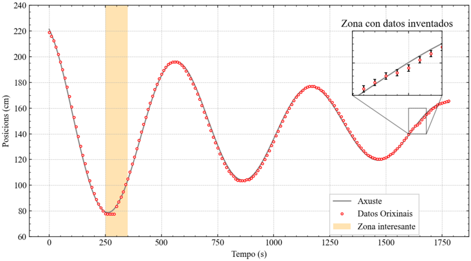

## Exemplo de matplotlib con moitas cousas

- Interfaz OOP
- matplotlibrc
- Patches
- Inset Axes

### Instalacion das dependencias
como sempre
```
python -m venv venv
.\venv\Scripts\activate
pip install -r requirements.txt
```
