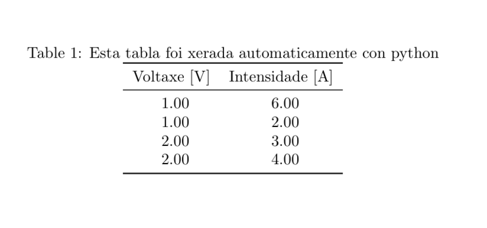

# CSV -> Pandas dataframe -> tabla de LaTeX

Convirte datos estructurados a unha tabla bonita de LaTeX usando
[pandas](https://pandas.pydata.org/docs/reference/index.html#api)

```
┌─────────────┐
│   datos     │
│estructurados│  pandas   ┌─────────┐  \input  ┌─────────────┐
│ (matrices,  │──────────►│tabla.tex├─────────►│documento.tex│
│ *.csv, etc.)│           └─────────┘          └─────────────┘
└─────────────┘
```

Tendo estos datos:
```csv
Voltaxe,Intensidade
1,6
1,2
2,3
2,4
```
xeramos esta tabla automáticamente:
```latex
\begin{table}[H]
\centering
\caption[Tabla feita con python]{Esta tabla foi xerada automaticamente con python}
\label{tab:Tabla bonita}
\begin{tabular}{SS}
\toprule
{Voltaxe [\unit{\volt}]} & {Intensidade [\unit{\ampere}]} \\
\midrule
1 & 6 \\
1 & 2 \\
2 & 3 \\
2 & 4 \\
\bottomrule
\end{tabular}
\end{table}
```
Que se ve tal que así:


## Instalación das dependencias

### Método Recomendado
no directorio onde están os arquivos:
```
python -m venv venv
.\venv\Scripts\activate
pip install -r requirements.txt
```
### Coa Makefile (só windows, e non prometo que funcione)
```
make # para rulalo todo
make limpar # para eliminar os arquivos xerados
```
