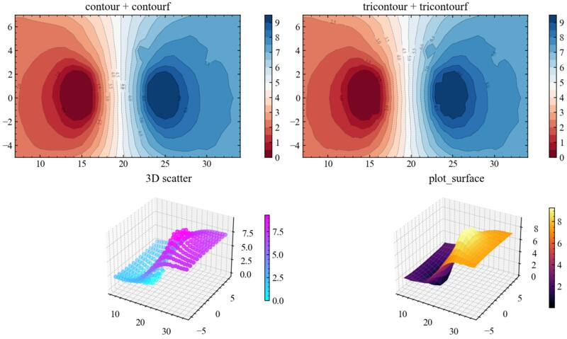
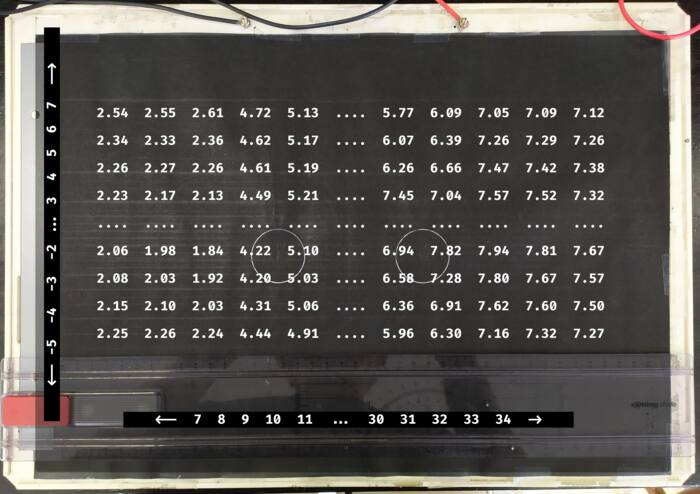

## Práctica de Laplace


Nesta práctica hai que tomar medidas dunha distribución de voltaxes nunha lámina
conductora. Logo, intentar representalos e comparalos dos datos proporcionados
polor profesores.

No guión menciónanse 2 maneiras de tomar os datos. Personalmente creo que tomar
datos equispaciados nunha rexión concreta é a mellor maneira. A idea é gardar
os datos nun arquivo CSV que corresponda, visualmente, á propia lámina
conductora. É dicir, algo así (véxase o arquivo datos.csv):



No lado esquero represento as posicións que chamarei 'y', e abaixo as 'x'.

### numpy.meshgrid
Algo confuso neste programa é a funcion `meshgrid`. Facendo np.meshgrid(x,y) obtemos
dous arrays similares a estos:

```
  7   7   7   7  ..  7   7   7   7   7
  6   6   6   6  ..  6   6   6   6   6
  5   5   5   5  ..  5   5   5   5   5
  4   4   4   4  ..  4   4   4   4   4
 ..  ..  ..  ..  .. ..  ..  ..  ..  ..
 -2  -2  -2  -2  .. -2  -2  -2  -2  -2
 -3  -3  -3  -3  .. -3  -3  -3  -3  -3
 -4  -4  -4  -4  .. -4  -4  -4  -4  -4
 -5  -5  -5  -5  .. -5  -5  -5  -5  -5
```

```
7   8   9  10  ..  13  30  31  32  33  34
7   8   9  10  ..  13  30  31  32  33  34
7   8   9  10  ..  13  30  31  32  33  34
7   8   9  10  ..  13  30  31  32  33  34
.   .   .  ..  ..  ..  ..  ..  ..  ..  ..
7   8   9  10  ..  13  30  31  32  33  34
7   8   9  10  ..  13  30  31  32  33  34
7   8   9  10  ..  13  30  31  32  33  34
7   8   9  10  ..  13  30  31  32  33  34
```

No primeiro caso temos unha especie de matriz con _todas_ as coordenadas x de cada punto
da lámina, e no segundo caso o mesmo, pero a coordenada y.

Cos datos orixinais e estas dúas matrices podemos representar fácilmente os datos
