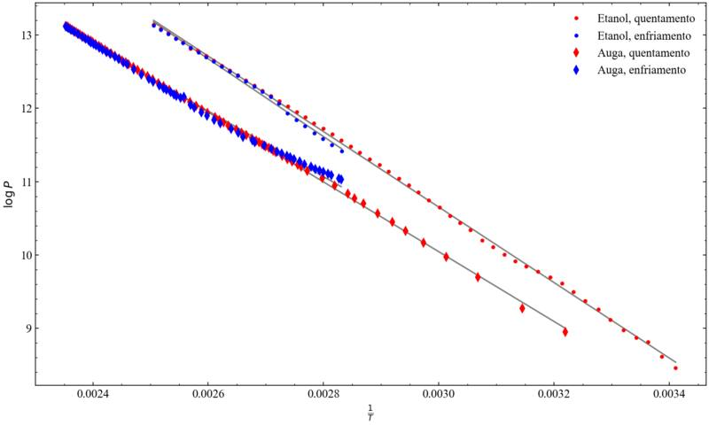

## ELVs analise pequeno



Este programilla o único que fai son 4 regresións lineales e as gráficas
correspondentes para a práctica de ELVs de termo. Non é un análise completo, so
é o que a profesora nos pediu no propio laboratorio para xustificar que fixemos
ben a práctica

### Instalación das dependencias
Como sempre
```
python -m venv venv
pip install -r requirements.txt
```


