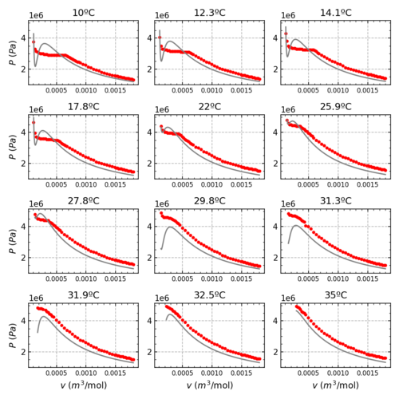

# Estudio PVT dun fluído

Esto é unha serie de programas que calculan multitude de cousas (non todo) da
practica PVT.

O arquivo principal fai o seguinte:

- Pasa os datos ao SI
- Calcula o numero de moles mediante regresions lineales
- Calcula o coeficiente 'B' do virial mediante regresions lineales
- Calcula os coeficientes 'a' e 'b' da ecuación de Van der Waals mediante axustes non lineais
- Calcula as densidades do fluido nas zonas de entrada e saida da campana de coexistencia, e axusta os datos a un polinomio de grao 2
- Calcula as regresións lineiais dos puntos medios destas densidades
- Calcula as regresions lineais de Clapeyron
- Calcula os calores de vaporizacion

Aparte, hai 8 arquivos para realizar as gráficas correspondentes
